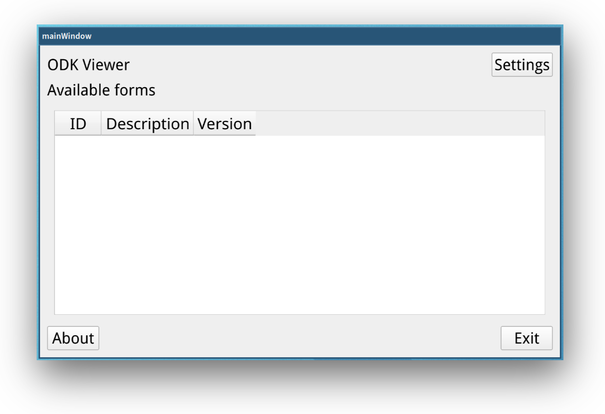

# ODK Viewer

A cross-platform tool to visualise ODK form data. Tested on GNU/Linux, Windows, and Android.

<p align="center">
  
</p>

[Open Data Kit (ODK)](https://opendatakit.org/) is a tool for collecting data on Android mobile devices. It presents a survey as a series of pages with questions. One of the features of ODK is that the user can send data directly from the field to a server on the Internet. However, once the data have been sent it is not possible to edit and resend.

Monitoring research quality in the field is an important element of carrying out good research, along with data cleaning processes and other data management activities. This initial monitoring and reviewing of the data is an ideal time for capturing and correcting initial errors while the data collection activity is fresh in the mind of the enumerators. With standard ODK (Version 1) reviewing and correcting the data on the device before sending is difficult as it requires scrolling through the survey pages and questions individually which can take a lot of time for larger surveys with many tabular questions.

ODK Viewer is a tool that complements ODK by displaying on-device data in tabular form and allows easier reviewing and editing of data before submission to the server.

If you use ODK Viewer please cite:

*Quiros, C. 2014. ODK Viewer: A tool to visualise ODK (version 1) data on Android devices. Nairobi, Kenya: ILRI. https://hdl.handle.net/10568/119269.*

## Build Requirements

- [Qt 5.x](https://doc.qt.io/qt-5/android.html)

## Build Instructions

Once you have Qt 5.x installed you can build the application:

```console
$ qmake
$ make
```

The resulting application will be called `odkviewer` in the same directory.

## Manual

https://hdl.handle.net/10568/35248

## Author

Carlos Quiros. Research Methods Group. International Livestock Research Institute.

## License

This work is licensed under the [GPLv3](https://www.gnu.org/licenses/gpl-3.0.en.html).

The license allows you to use and modify the work for personal and commercial purposes, but if you distribute the work you must provide users with a means to access the source code for the version you are distributing. Read more about the [GPLv3 at TL;DR Legal](https://tldrlegal.com/license/gnu-general-public-license-v3-(gpl-3)).
